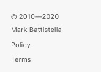

# Getting started

## Installation
1. Configure the `docsify-autoFooter`:
```js
<script>
window.$docsify = {
    autoFooter: {
		name:		'',
		url:		'',
		copyYear:	'',
		policy:		'',
		terms:		''
	}
};
</script>
```

2. Insert script into docsify document:
```js
<script src="docsify-sidebarFooter.js"></script>
```

3. If you are using the Privacy Policy and Terms of Service links, then add the two files to the root (next to `index.html`)

	```
	| docs
	|-- _privacy.md
	|-- _terms.md
	```

4. Add the `<div id="mb-footer"></div>` to the bottom of the `_sidebar.md`. I guess you can add this anywhere, but it's designed for the sidebar.

5. Find a couple of online generators to help fill in the data :smiley:


## Configuration
There are some options available for the `docsify-autoHeaders`:

| setting   | options |
| :-------- | :------ |
| name		| your name or your company - whoever is the owner
| url		| the url you want the name to link to (optional)
| copyYear	| the first year of copyright. leave blank for current year
| policy	| do you have a Privacy Policy page
| terms		| do you have a Terms of Service page

## Usage
Fill in the data within the configuration, and it will all auto populate.


## Example


# Contributing
1. Clone the repo:
	```
	git clone https://github.com/markbattistella/docsify-sidebarFooter.git
	```

2. Create your feature branch:
	```
	git checkout -b my-feature
	```

3. Commit your changes:

	```
	git commit -am 'Add some feature'
	```

4. Push to the branch:

	```
	git push origin my-new-feature
	```

5. Submit a `pull` request


---

# Author: [@me](https://github.com/markbattistella)

- 🔭 I’m currently working on some secret projects
- 🌱 I’m learning
- 📫 Reach me: [Twitter 🐦](https://twitter.com/markbattistella)

---
