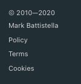

# docsify-sidebarfooter

   

This plugin is designed to create a footer area at the base of your sidebar where you can list a copyright year, your name or company with a URL, and links to a privacy policy and terms of service.

## Installation

### Update `index.html` file

Assuming you have a working [docsify](https://docsify.js.org/) framework set up, it is easy to use the plugin.

1. Add the following script tag to your `index.html` via either CDN or downloading it and using it locally:

    ```html
    <!-- unpkg.com -->
    <script src="https://unpkg.com/docsify-sidebarfooter"></script>

    <!-- jsDelivr -->
    <script src="https://cdn.jsdelivr.net/npm/docsify-sidebarfooter"></script>

    <!-- locally -->
    <script src="docsify-sidebarfooter.js"></script>
    ```

1. In docsify setup configure the plugin:

    ```js
    <script>
    window.$docsify = {
      autoFooter: {
        name:     '',
        url:      '',
        copyYear: '',
        policy:   '',
        terms:    ''
      }
    };
    </script>
    ```

### Configuration

There are some options available for the `docsify-sidebarfooter`:

| setting   | options |
| :-------- | :------ |
| name      | your name or your company - whoever is the owner
| url       | the url you want the name to link to (optional)
| copyYear  | the first year of copyright. leave blank for current year
| policy    | do you have a Privacy Policy page
| terms     | do you have a Terms of Service page

### Additional files

If you are using the Privacy Policy and Terms of Service links, then add the two files to the root (next to `index.html`)

```md
| docs/
|-- _privacy.md
|-- _terms.md
```

### Usage

At the bottom of your `_sidebar.md` file add the following code:

```html
<div id="mb-footer"></div>
```

You _can_ add this anywhere, but it's designed for the sidebar.

## Example



## Contributing

1. Clone the repo:

    `git clone https://github.com/markbattistella/docsify-sidebarFooter.git`

2. Create your feature branch:

    `git checkout -b my-feature`

3. Commit your changes:

    `git commit -am 'Add some feature'`

4. `Push` to the branch:

    `git push origin my-new-feature`

5. Submit the `pull` request
